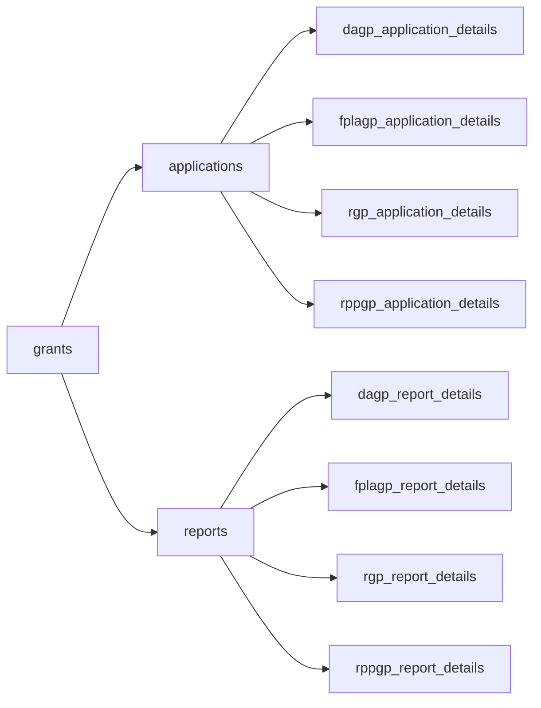

# Grants, Applications, Reports: Dummy Data

## General Shape of .duckdb

## Acronyms
- Conservation Reserve Enhancement Program (CREP)
- Disaster Assistance Program (DAP)
- Farmland Protection and Land Access (FPLA) Program
- Forest Health and Community Wildfire Resiliency (CWR)
- Irrigation Efficiencies Grant Program (IEGP)
- Natural Resource Investments (NRI)
- Riparian Grant Program (RGP)
- Riparian Plant Propagation Program (RPPP)
- Shellfish Program (SP)
- Sustainable Farms & Fields (SFF)
- Sustainable Farms & Fields: Climate-Smart Livestock (SFFCSL)