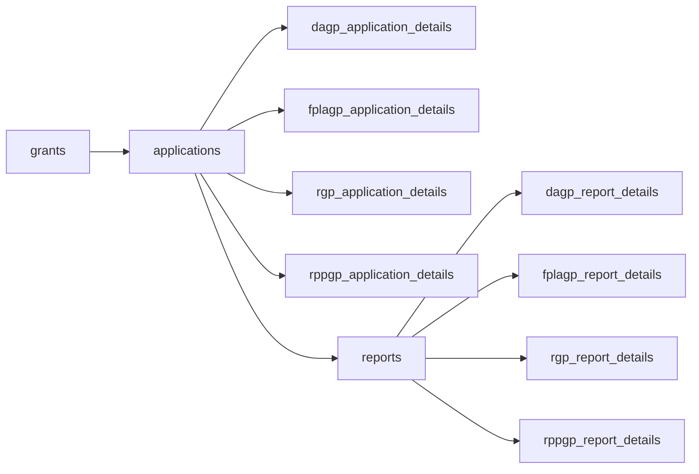

# Grants, Applications, Reports: Dummy Data
## Usage
1. Activate the virtual environment with
```
poetry install
poetry shell
```
2. Generate the dummy data .duckdb
```
cd core
python3 generate.py
```
3. Skip right to the duckdb tables as .csv files at ~/grants_dummy_data/core/output_data

## General Shape of .duckdb

See a more in depth view, [here](https://github.com/CR-Lough/mock-grants-data/blob/main/grant-application-schema.md)

## Acronyms
- Conservation Reserve Enhancement Program (CREP)
- Disaster Assistance Program (DAP)
- Farmland Protection and Land Access (FPLA) Program
- Forest Health and Community Wildfire Resiliency (CWR)
- Irrigation Efficiencies Grant Program (IEGP)
- Natural Resource Investments (NRI)
- Riparian Grant Program (RGP)
- Riparian Plant Propagation Program (RPPP)
- Shellfish Program (SP)
- Sustainable Farms & Fields (SFF)
- Sustainable Farms & Fields: Climate-Smart Livestock (SFFCSL)